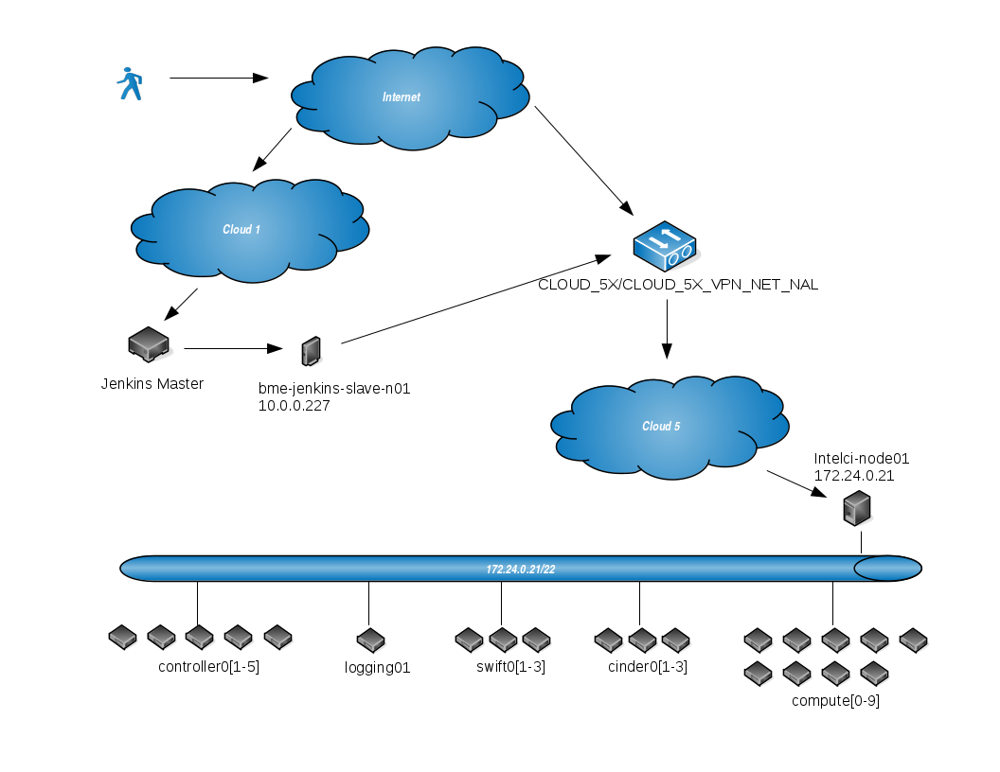
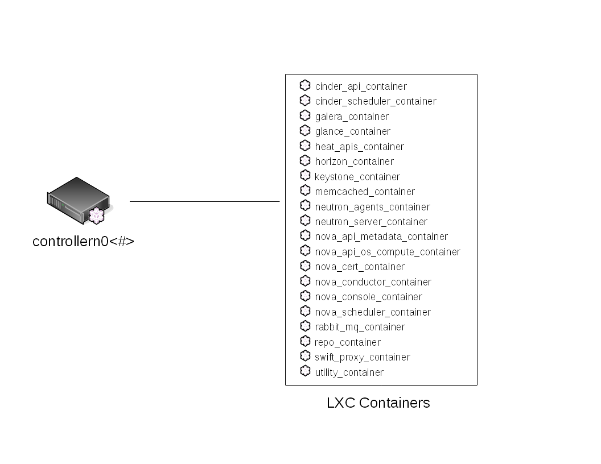
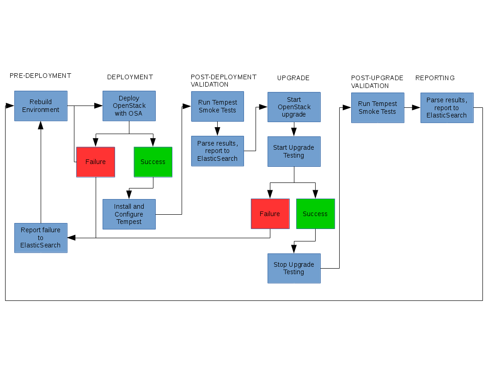

# qe-jenkins-baremetal
#Bare Metal Environment(BME)
Currently implemented in Cloud5. This is a 22 node environment which uses bare metal servers for deploy of OpenStack via [OpenStack-Ansible](https://github.com/openstack/openstack-ansible).

##Access
This does require a VPN with user/pass. In order to ease access concerns, this environment can be accessed through the bme-jenkins-slave-n01 via the jumpbox.

###VPN - f5fpc
This command line client is used to enable/disable a VPN to the Cloud5 environment.

* View connection status
  * `f5fpc --info`
* Connect to VPN on Cloud5 **env variables are set on login for ubuntu user on bme-jenkins-slave-n01**
  * `f5fpc --start --host ${CLOUD_HOST} --user ${CLOUD_USER} --password ${CLOUD_PASS} --nocheck`
* Connect to intelci-node01 (deploy node) **SSH keys used for access**
  * `ssh root@172.24.0.21`
* Disconnect to VPN on Cloud5 **do not disconnect VPN if a job is running on this environment**
  * `f5fpc --stop`

##Nodes
On intelci-node01, hosts file is configured for all nodes. SSH is keyed throughout environment *ex. `ssh controller01`*.

Nodes:    

Each controller node has multiple containers:    

##CI/CD Workflow
This is a work in progress as the environment is being configured and tested, process workflow is being implemented as:    

#Environment Configuration

## Required packages
cd /root  
apt-get update -y  
apt-get install -y python-dev curl  
wget -k https://bootstrap.pypa.io/get-pip.py  
python get-pip.py  

#### openstack_release <= Mitaka
Due to this bug - _https://github.com/ansible/ansible-modules-extras/issues/2042_  
pip 'install' 'git+https://github.com/ansible/ansible@stable-1.9'

#### openstack_release >= Newton
pip install ansible

## Clone this repo to deployment host /root directory
cd /root  
git clone http://github.com/osic/qa-jenkins-baremetal

## Change into repo directory
cd /root/qa-jenkins-baremetal

## Provision servers (does not include deployment host)
ansible-playbook -f 22 -i inventory provision.yml

## Configure servers (packages/networking/etc)
ansible-playbook -f 22 -i inventory configure.yml --ask-pass

## Prepare the deployment host to install openstack-ansible  
If openstack_release is not set master branch is used  
ansible-playbook -i inventory stage.yml -e "openstack_release='stable/mitaka'"
